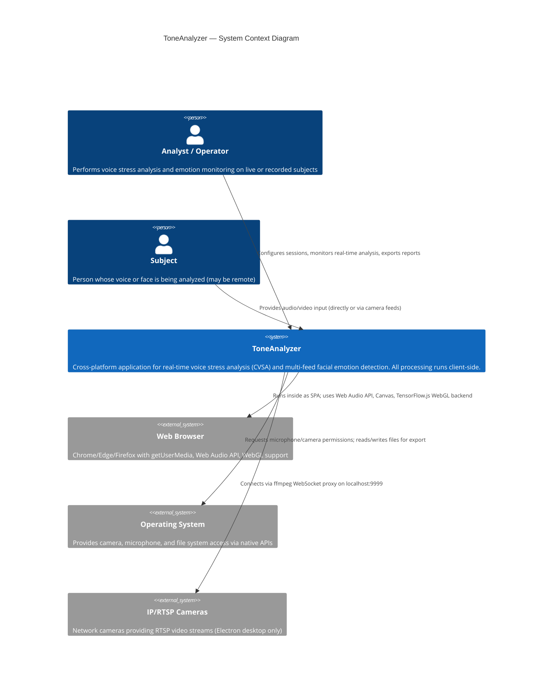

# C4 Level 1 — System Context Diagram

Shows ToneAnalyzer as a black box and its relationships with users and external systems.

## System Context

## Key Observations

- **No backend server**: ToneAnalyzer is entirely client-side. No data leaves the user's device unless explicitly exported.
- **Privacy by architecture**: Audio/video streams are processed in-browser using Web Audio API and TensorFlow.js. No cloud AI services are invoked.
- **HTTPS requirement**: Production deployments require HTTPS for `getUserMedia` access (microphone/camera). Only `localhost` is exempt.
- **Platform reach**: The same React SPA deploys to web browsers, Electron (desktop), and Capacitor (iOS mobile).
