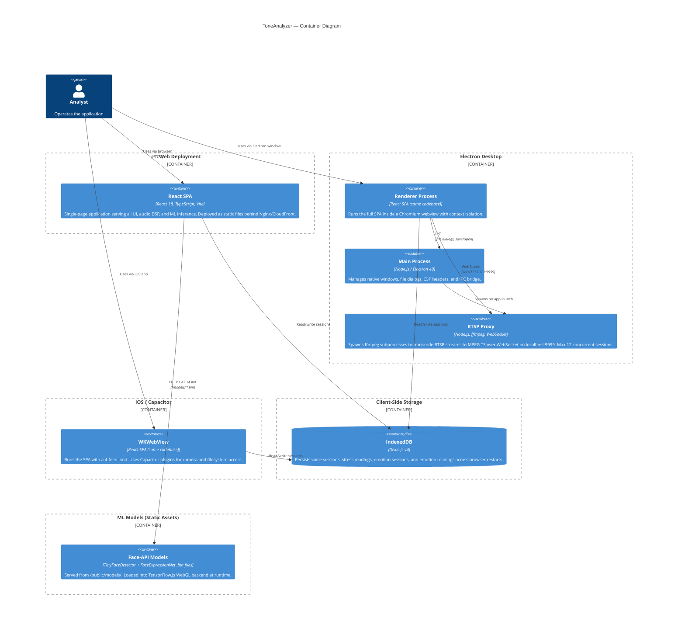
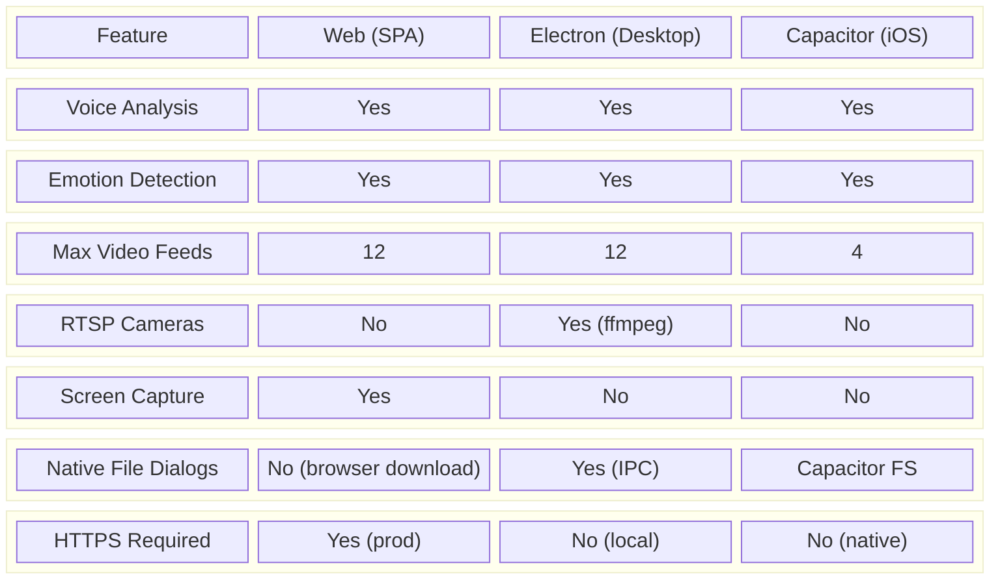
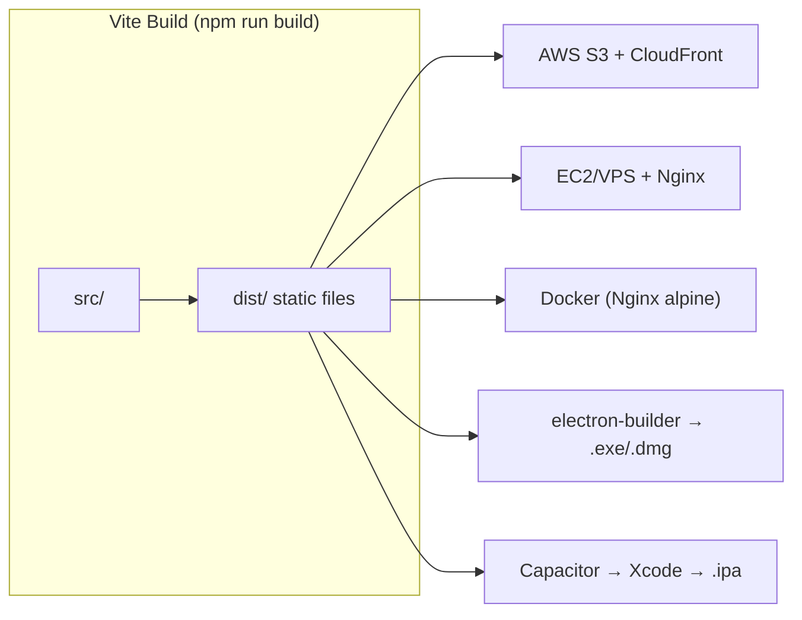

# C4 Level 2 — Container Diagram

Breaks ToneAnalyzer into its deployable/runnable units and shows their interactions.

## Container Overview

## Platform Capability Matrix

## Deployment Variants

