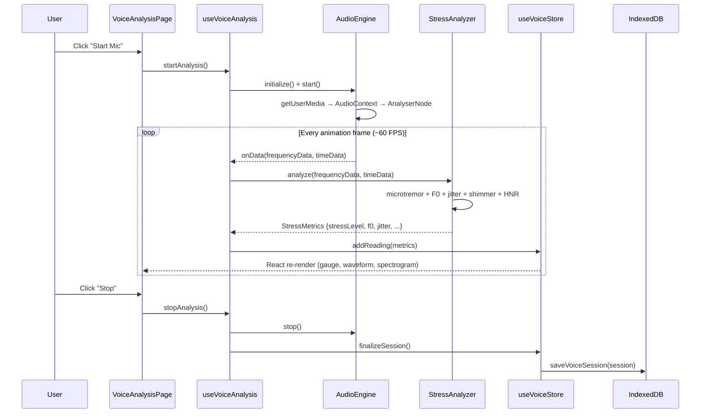
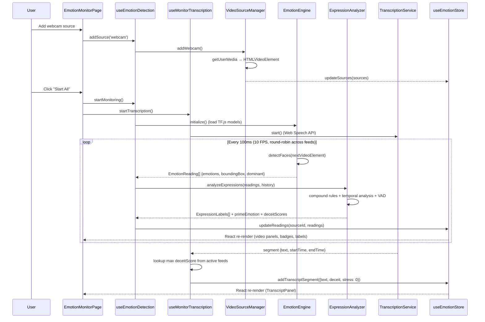

# C4 Level 3 — Component Diagram

Details the internal modules within the React SPA container.

## SPA Component Architecture

```mermaid
C4Component
    title ToneAnalyzer SPA — Component Diagram

    Container_Boundary(spa, "React SPA") {

        Component_Ext(router, "React Router", "react-router-dom v6", "Routes: / (voice), /emotions, /settings")

        Component_Boundary(voiceFeature, "Voice Analysis Feature") {
            Component(voicePage, "VoiceAnalysisPage", "React Page", "Main UI: mic controls, waveform, spectrogram, stress gauge, metric cards")
            Component(audioEngine, "AudioEngine", "TypeScript Class", "Web Audio API wrapper: getUserMedia, AnalyserNode (8192 FFT), AudioWorklet for PCM capture")
            Component(stressAnalyzer, "StressAnalyzer", "TypeScript Class", "CVSA algorithms: microtremor (8-14Hz), F0 detection, jitter, shimmer, HNR, composite score")
            Component(transcriptionService, "TranscriptionService", "TypeScript Class", "Web Speech API wrapper: continuous recognition, interim/final segments, auto-restart")
            Component(useVoiceHook, "useVoiceAnalysis", "React Hook", "Orchestrates AudioEngine → StressAnalyzer pipeline, manages analysis lifecycle")
        }

        Component_Boundary(emotionFeature, "Emotion Detection Feature") {
            Component(emotionPage, "EmotionMonitorPage", "React Page", "Grid layout selector, video panels, add source controls, live transcript panel")
            Component(emotionEngine, "EmotionEngine", "TypeScript Class", "TensorFlow.js face-api: TinyFaceDetector + FaceExpressionNet, round-robin across feeds, 10 FPS default")
            Component(expressionAnalyzer, "ExpressionAnalyzer", "TypeScript Class", "50+ derived expression rules: compound emotions, temporal indicators, VAD model, prime emotion (60s window)")
            Component(videoSourceMgr, "VideoSourceManager", "TypeScript Class", "Manages webcam, file, screen, RTSP sources with lifecycle and pause/resume")
            Component(useEmotionHook, "useEmotionDetection", "React Hook", "Orchestrates VideoSourceManager → EmotionEngine → ExpressionAnalyzer pipeline")
            Component(useMonitorTranscription, "useMonitorTranscription", "React Hook", "Wraps TranscriptionService for emotion monitor, maps facial deceit scores to transcript segments")
        }

        Component_Boundary(stores, "State Management (Zustand)") {
            Component(appStore, "useAppStore", "Zustand Store", "Global settings: audio device, stress threshold (70%), grid layout, FPS, export format")
            Component(voiceStore, "useVoiceStore", "Zustand Store", "Current/past voice sessions, stress readings, real-time frequency/time-domain data")
            Component(emotionStore, "useEmotionStore", "Zustand Store", "Active video sources, emotion readings per source, monitoring sessions, transcript segments, grid layout")
        }

        Component_Boundary(services, "Services") {
            Component(dbService, "DatabaseService", "Dexie.js", "IndexedDB tables: sessions, stressReadings, emotionSessions, emotionReadings")
            Component(exportService, "ExportService", "TypeScript", "CSV (PapaParse) and PDF (jsPDF) generation for voice and emotion data, including transcript sections")
            Component(platformUtils, "PlatformUtils", "TypeScript", "Platform detection: electron/ios/web, feature gates for RTSP, screen capture, feed limits")
        }

        Component_Boundary(uiComponents, "Shared UI Components") {
            Component(layout, "Layout + Sidebar", "React", "Dark theme shell, navigation, responsive sidebar")
            Component(viz, "Visualizations", "React + Canvas", "StressGauge (SVG), Waveform (Canvas), Spectrogram (Canvas), EmotionBadge, ExpressionLabels")
            Component(videoPanel, "VideoPanel + VideoGrid", "React + Canvas", "Video feed rendering with bounding box overlay, emotion badges, expression labels")
        }
    }

    Rel(router, voicePage, "/ route")
    Rel(router, emotionPage, "/emotions route")

    Rel(voicePage, useVoiceHook, "calls")
    Rel(useVoiceHook, audioEngine, "initializes, starts/stops")
    Rel(useVoiceHook, stressAnalyzer, "feeds audio data")
    Rel(useVoiceHook, voiceStore, "updates state")
    Rel(voicePage, viz, "renders")

    Rel(emotionPage, useEmotionHook, "calls")
    Rel(emotionPage, useMonitorTranscription, "calls")
    Rel(useEmotionHook, videoSourceMgr, "adds/removes sources")
    Rel(useEmotionHook, emotionEngine, "processes video frames")
    Rel(useEmotionHook, expressionAnalyzer, "derives expressions")
    Rel(useEmotionHook, emotionStore, "updates state")
    Rel(useMonitorTranscription, transcriptionService, "wraps")
    Rel(useMonitorTranscription, emotionStore, "adds transcript segments")
    Rel(emotionPage, videoPanel, "renders per source")

    Rel(voiceStore, dbService, "persists sessions")
    Rel(emotionStore, dbService, "persists sessions")
    Rel(exportService, voiceStore, "reads session data")
    Rel(exportService, emotionStore, "reads session data")
```

## Component Interaction Sequence — Voice Analysis



## Component Interaction Sequence — Emotion Detection


