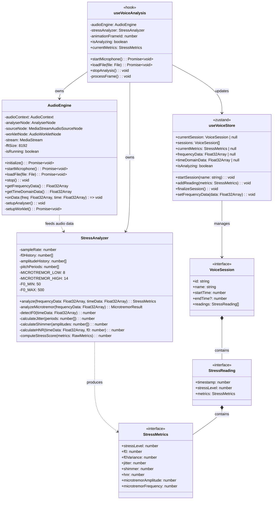
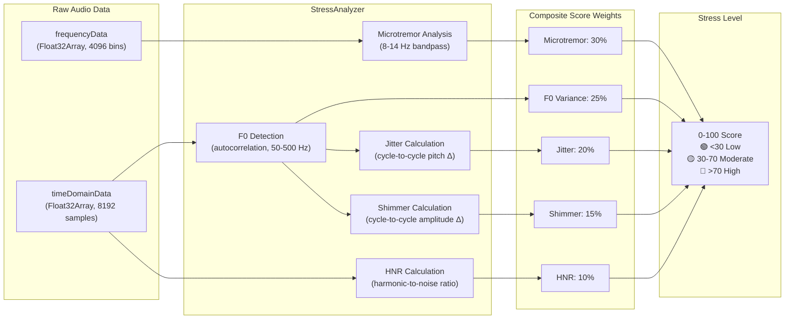
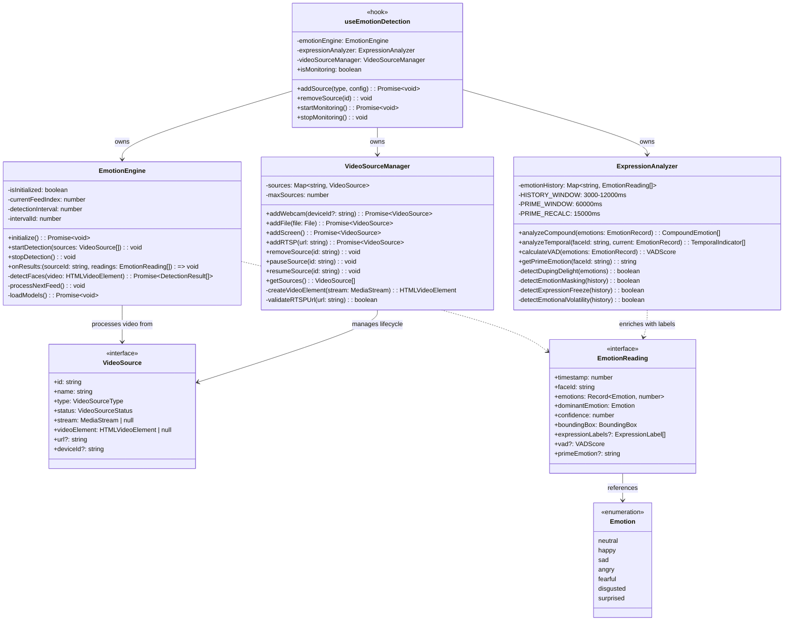
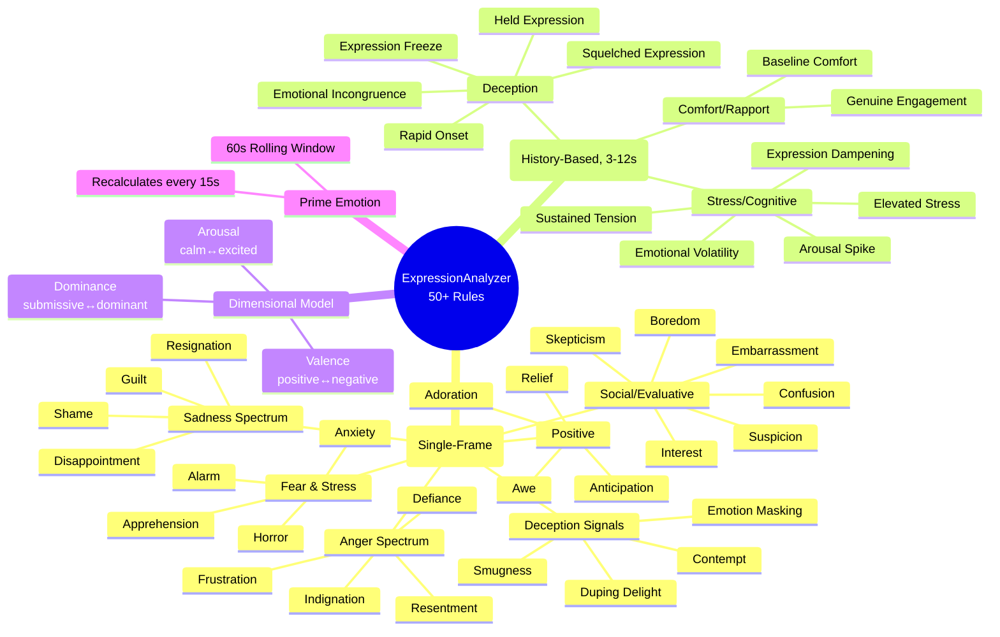

# C4 Level 4 — Code Diagrams

Class-level detail for the two core processing pipelines.

## Voice Analysis Pipeline — Class Diagram

## Stress Score Computation

## Emotion Detection Pipeline — Class Diagram

## Expression Analysis Rules — Categorization

