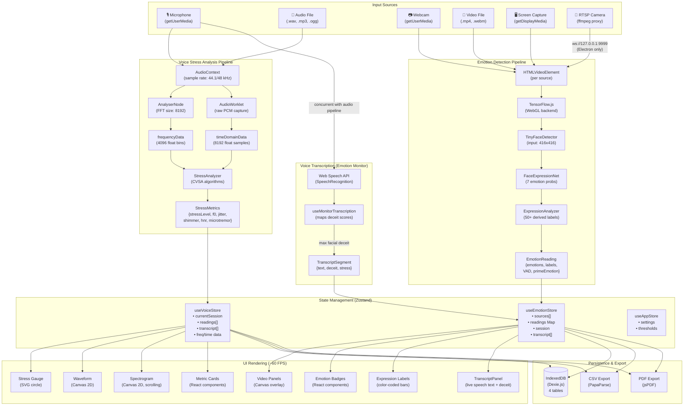
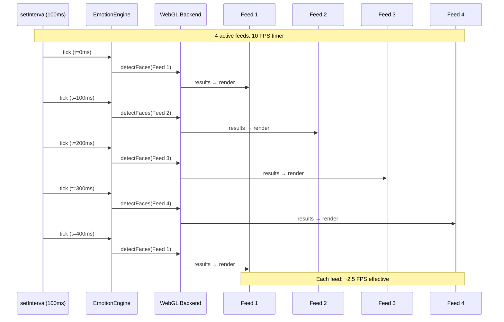
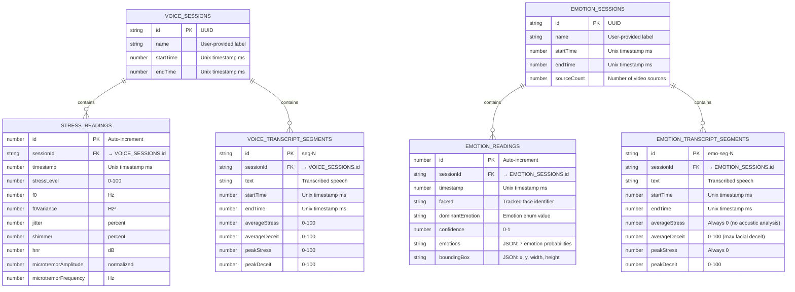

# Data Flow & Latency Diagrams

Supplementary diagrams showing end-to-end data flow and latency budgets.

## End-to-End Data Flow

## Latency Budget — Voice Analysis

```mermaid
gantt
    title Voice Analysis Frame Latency Budget (~16.7ms target at 60 FPS)
    dateFormat X
    axisFormat %Lms

    section Audio Capture
    getUserMedia buffer         :a1, 0, 3
    AnalyserNode FFT (8192)     :a2, 3, 5

    section DSP Processing
    Microtremor bandpass (8-14Hz) :b1, 5, 7
    F0 autocorrelation           :b2, 7, 10
    Jitter + Shimmer calc        :b3, 10, 12
    HNR calculation              :b4, 12, 13
    Composite score              :b5, 13, 14

    section State + Render
    Zustand store update         :c1, 14, 14
    React reconciliation         :c2, 14, 15
    Canvas draw (waveform+spectro):c3, 15, 17
```

> **Note**: The 8192-sample FFT at 44.1 kHz gives ~186ms of audio per frame. Analysis runs on the latest buffer each animation frame. The DSP computations are lightweight (pure math on typed arrays) and consistently complete within the 16.7ms frame budget.

## Latency Budget — Emotion Detection

```mermaid
gantt
    title Emotion Detection Per-Feed Latency Budget (~100ms target at 10 FPS)
    dateFormat X
    axisFormat %Lms

    section Video Capture
    Video frame decode          :a1, 0, 5

    section ML Inference (WebGL)
    Canvas drawImage (resize)   :b1, 5, 7
    TinyFaceDetector forward    :b2, 7, 45
    FaceExpressionNet forward   :b3, 45, 75

    section Post-Processing
    Expression rules (50+ checks):c1, 75, 82
    Temporal analysis (history)  :c2, 82, 88
    VAD + Prime calculation      :c3, 88, 92

    section State + Render
    Zustand store update         :d1, 92, 93
    React reconciliation         :d2, 93, 95
    Canvas overlay (bbox + labels):d3, 95, 100
```

> **Note**: With round-robin scheduling, each feed gets processed once every `100ms × N` where N = number of active feeds. For 4 feeds, each gets ~2.5 FPS effective; for 12 feeds, ~0.83 FPS effective. This is intentional — GPU contention from parallel inference would degrade all feeds.

## Round-Robin GPU Scheduling

## Data Persistence Schema

